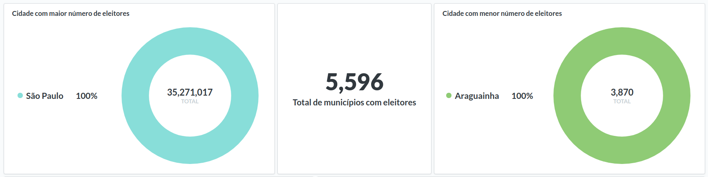
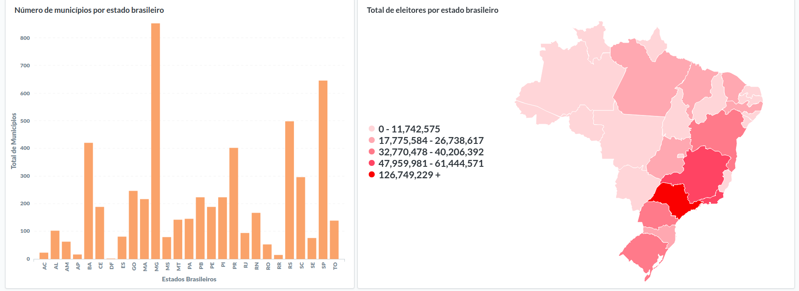
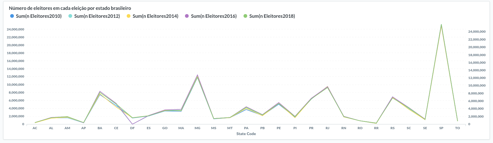

# Exploring open data using Metabase

This repository contains the exploration of open data using Metabase.

### First analysis:
The first simple exploration was done with the number of voters in the last elections in Brazil.
The data have obtained from IPEA: http://www.ipeadata.gov.br

Following the dasboard generated during the exploration:

